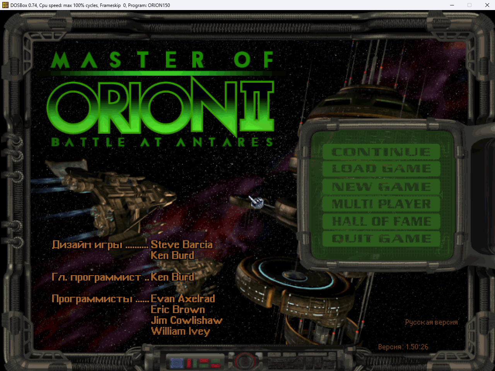
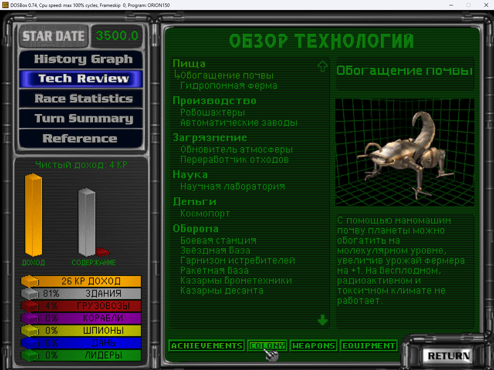
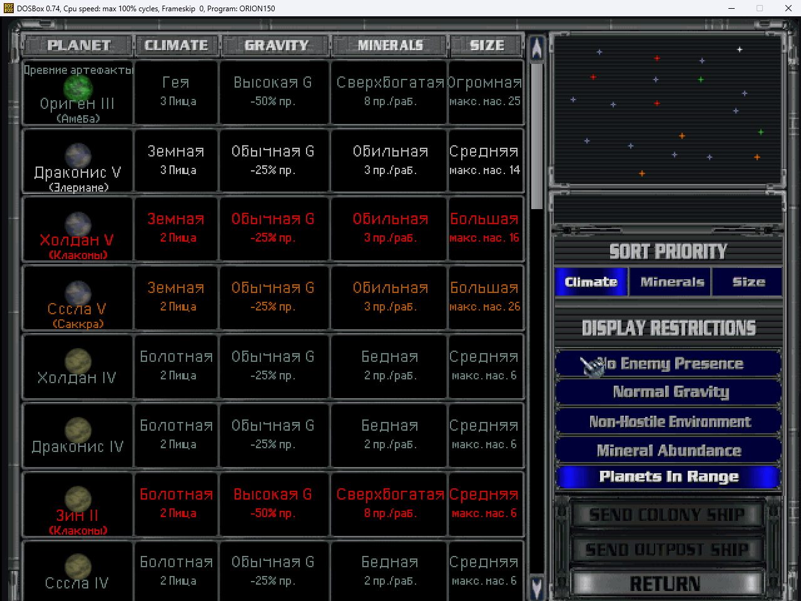

# Master of Orion II — Russian translation

[Русский](README.md) | **English**

A complete Russian translation of *Master of Orion II: Battle at Antares* for patch 1.50.26

[Overview](#overview) • [Screenshots](#screenshots) • [Requirements](#requirements) • [Installation](#installation) • [Developers](#developers) • [Credits](#credits) • [License](#license)

## Overview

The translation targets the **1.50 improved** core mod: the numbers in the
help texts match its rules.

- all of the game's text is translated: help and reference, technologies and
  buildings, diplomacy, events, the Council, leaders, race creation, combat —
  about 12,500 strings;
- Cyrillic in every game font;
- strings compiled into the game and into the 1.50 patch are translated;
- star, ship and ruler names are transliterated.

Not translated: buttons, the 1.50 hot key scripts and the Mirror mod message.

> **Open beta.** The translation may contain inaccuracies and errors, and
> some late-game screens have only been spot-checked. If some text does not
> fit or reads oddly, please [report it](../../issues/new/choose) with a
> screenshot.

## Screenshots

## Requirements

- Master of Orion II (GOG or Steam) with patch **1.50.26**
  ([moo2mod.com](https://moo2mod.com/)) — the game folder must contain
  `ORION150.EXE` and a `150` folder;
- Windows.

## Installation

1. Download `moo2-rus-<version>.zip` from [Releases](https://github.com/Code0I7/moo2-rus/releases).
2. Unpack the `moo2-rus` folder into the game folder, next to `ORION150.EXE`.
3. Run `moo2-rus\moo2-rus.exe` and choose **1 — install**.
4. Start the game from the Launcher; **Russian** should be ticked under "Mods".

The installer builds the translation from your own game files and keeps the
originals in `moo2-rus\backup` — do not delete that folder, uninstalling
needs it. If Windows warns about an unknown publisher: "More info" → "Run
anyway".

**Uninstall:** run `moo2-rus.exe` and choose **2 — uninstall**.
Saved games remember that they were started with the translation: after
uninstalling they open in English, but their star and colony names stay
Russian and will not be displayed. Continue such games with the translation
installed.

## Developers

- [Technical documentation](docs/DEVELOPMENT-en.md) — data formats, engine
  patches, build pipeline;
- [Contributing](CONTRIBUTING-en.md) — translation fixes, checks;
- [Abbreviations and terms](docs/ABBREVIATIONS.md) (in Russian),
  [changelog](docs/CHANGELOG.md).

From source: `python make.py install` (Python 3.8+, standard library only).

## Credits

- **[Code0I7](https://github.com/Code0I7)** — idea, project architecture and
  coordination, in-game testing;
- **[Claude Code](https://claude.com/claude-code)** (Anthropic) — translation,
  tooling, engine research and patches.

Thanks to the authors of the unofficial **1.50** patch and the
**1.50 improved** mod ([moo2mod.com](https://moo2mod.com/)), and to Simtex
and MicroProse for the game.

## License

Code and translation — [MIT](LICENSE). Master of Orion is a trademark of its
respective owners; this is a non-commercial fan project and contains no game
files.
